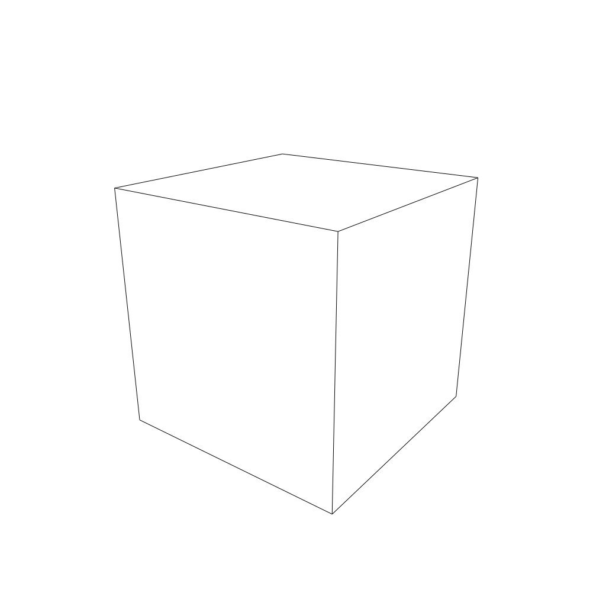
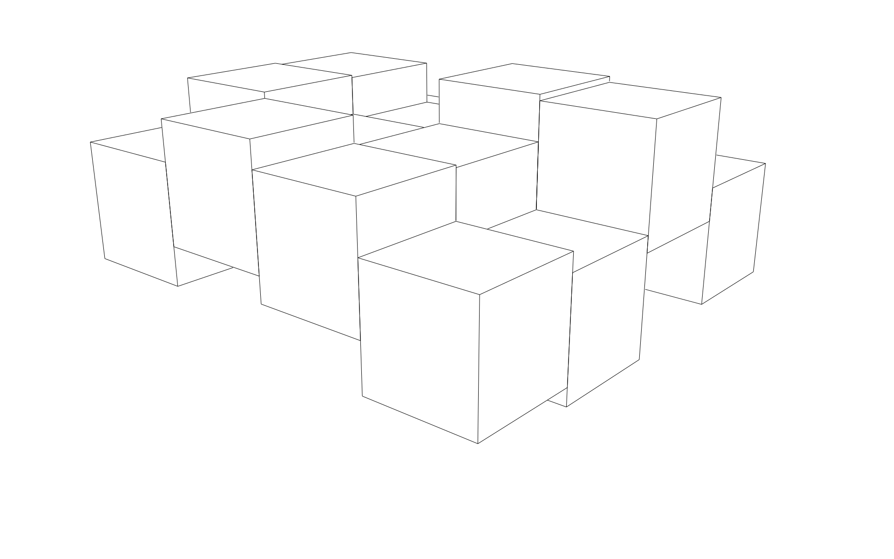
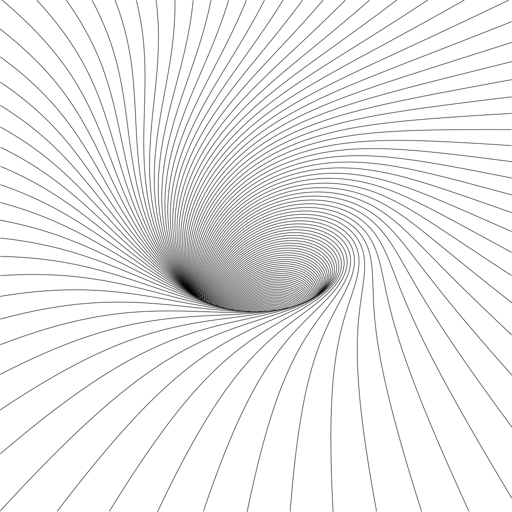
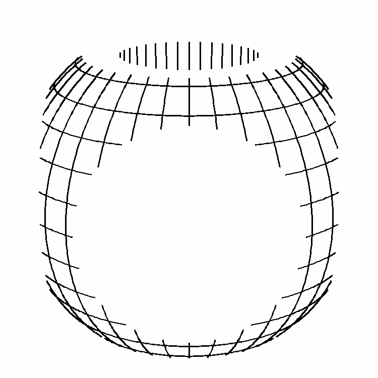
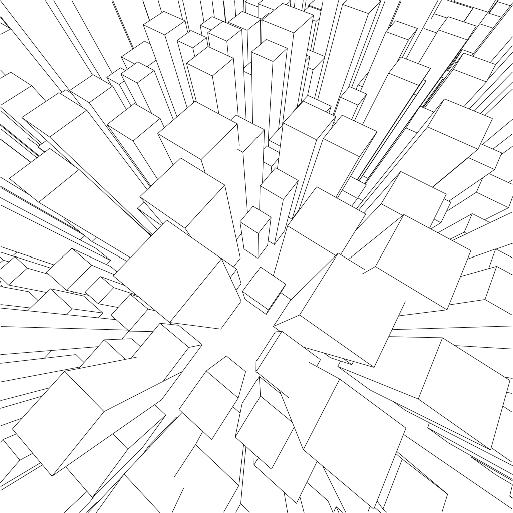
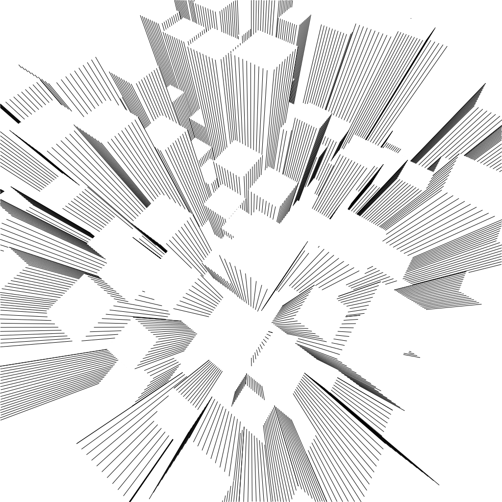
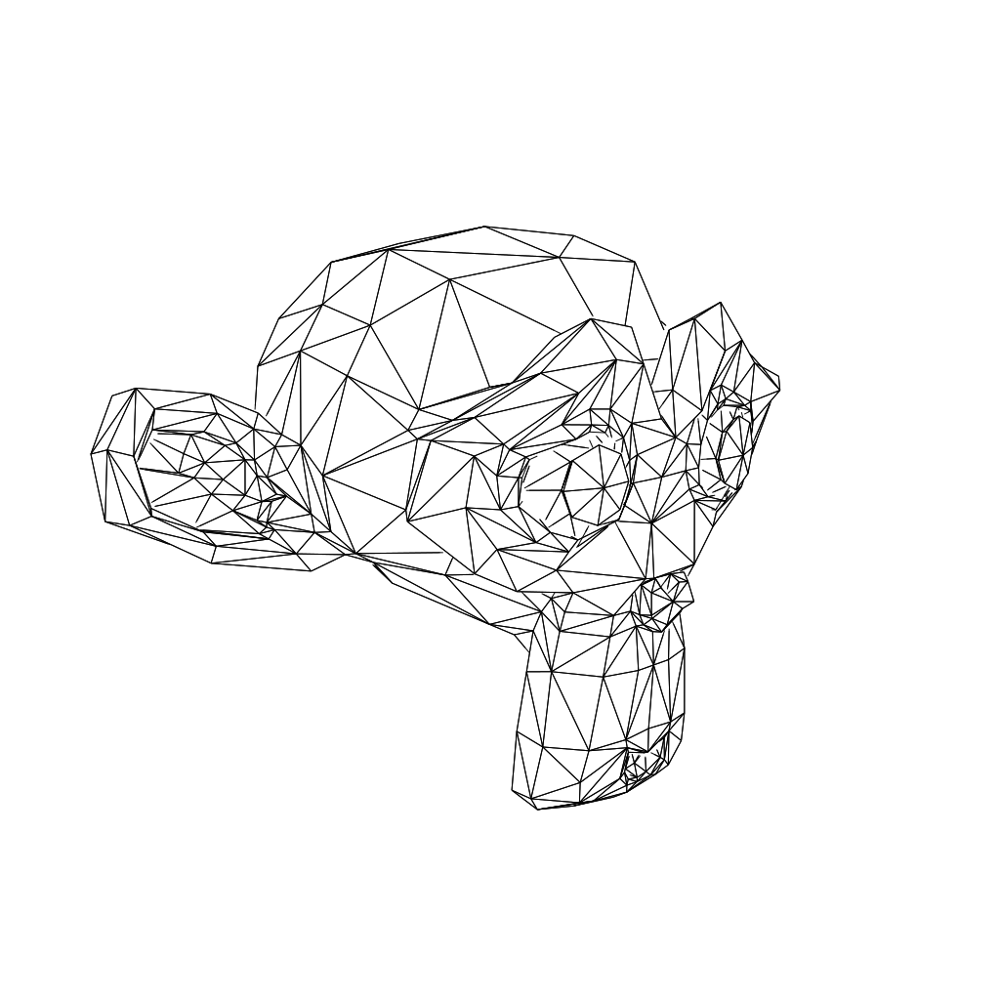

# pyln

[comment]: <> ([![Build status]&#40;https://github.com/out-of-cheese-error/pyln/workflows/build/badge.svg?branch=master&event=push&#41;]&#40;https://github.com/out-of-cheese-error/pyln/actions?query=workflow%3Abuild&#41;)
[comment]: <> ([![Python Version]&#40;https://img.shields.io/pypi/pyversions/pyln.svg&#41;]&#40;https://pypi.org/project/pyln/&#41;)

## a (WIP) Python 3D line art engine
This is a complete Python port of [fogleman/ln](https://github.com/fogleman/ln) (with some help from [ln.py](https://github.com/ksons/ln.py)) using NumPy, Numba, and Pillow.

### Examples
Images rendered from the scripts in the [examples folder](examples):

#### [Cube](examples/cube.py)

#### [Cubes](examples/cubes.py)

#### [Function](examples/function.py)

[comment]: <> (#### [Beads]&#40;examples/beads.py&#41;)

[comment]: <> (![beads]&#40;examples/images/beads.svg&#41;)

#### [CSG (Constructive Solid Geometry)](examples/csg.py)

#### [Outline](examples/outline.py)

[comment]: <> (#### [Cones]&#40;examples/cones.py&#41;)

[comment]: <> (![cones]&#40;examples/images/cones.svg&#41;)

#### [Skyscrapers](examples/skyscrapers.py)

#### [Striped Skyscrapers](examples/skyscrapers_striped.py)

#### [Suzanne (from .obj file)](examples/suzanne.py)

#### [Suzanne (voxelized, from .stl file)](examples/voxelize.py)

## Credits

This project was generated with [`python-package-template`](https://github.com/TezRomacH/python-package-template).
